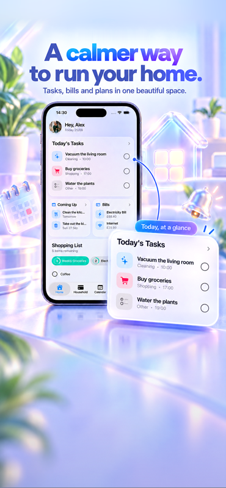
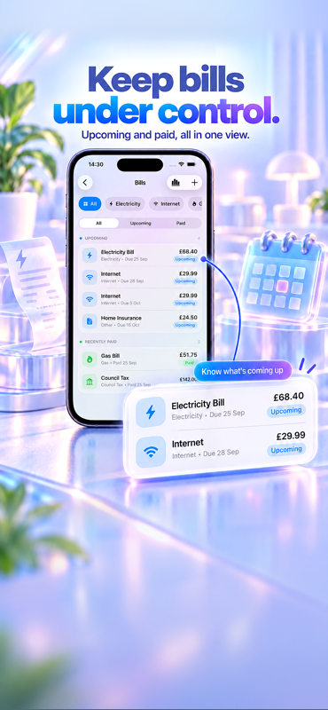
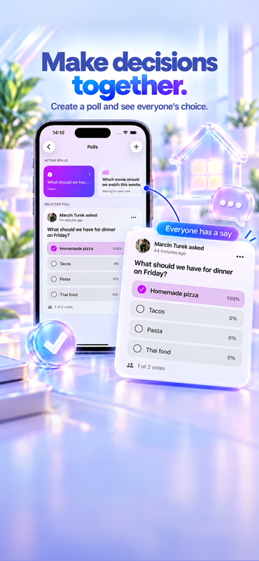
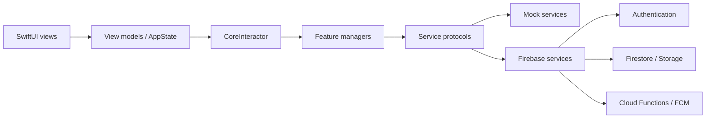

# HouseMate

HouseMate is a native iOS app for organising everyday life in a shared home. It gives housemates one place for chores, tasks, shopping, bills, reminders, polls, documents and household updates.

This repository showcases a production-oriented SwiftUI codebase with environment-specific dependency injection, Firebase-backed collaboration, offline-friendly caching, push notifications and automated security tests.

<p align="center">
  
  
  
  
  
</p>

## Highlights

- Shared households with owner/member permissions and invitation codes
- Tasks, recurring chores and automatic weekly assignments
- Collaborative shopping lists with real-time updates
- Household bills, recurring payments and payment history
- Reminders, polls, notes, documents and a shared activity board
- Sign in with Apple and Google Sign-In
- Local notifications and Firebase Cloud Messaging
- Cached startup state and feature data for a responsive launch experience
- Separate Mock, Development and Production environments
- Account deletion, privacy manifest and security-focused Firestore rules

## Technical overview

| Area | Implementation |
| --- | --- |
| UI | SwiftUI, Observation, native navigation and reusable feature components |
| Architecture | Protocol-oriented services, manager layer, dependency container and environment-specific composition |
| Backend | Firebase Authentication, Cloud Firestore, Cloud Storage and Cloud Functions |
| Reliability | Local caching, Firestore listeners, defensive state restoration and Crashlytics |
| Notifications | UserNotifications, Firebase Cloud Messaging and scheduled Cloud Functions |
| Analytics | Typed analytics abstraction with a Mixpanel implementation and no-op Mock implementation |
| Security | Firebase App Check, least-privilege Firestore/Storage rules and dedicated invite lookup documents |
| Testing | Swift Testing unit tests and Firebase Emulator Suite rule tests |

## Architecture



The UI depends on feature managers through `CoreInteractor`, while concrete services are selected in `DependencyContainer`. The same application can therefore run entirely in memory using `HouseMate-Mock`, or connect to separate Development and Production Firebase projects.

This separation keeps feature logic testable and prevents previews, unit tests and portfolio reviewers from requiring access to private backend infrastructure.

## Run locally

### Requirements

- macOS with Xcode 26.5 or later
- An iOS 26.5 simulator or compatible device

### Portfolio / Mock environment

The Mock environment contains sample data and does not require Firebase credentials.

1. Clone the repository.
2. Open `HouseMate.xcodeproj` in Xcode.
3. Select the `HouseMate-Mock` scheme.
4. Choose an iPhone simulator.
5. Build and run.

The Mock scheme is the recommended way to explore the project. Development and Production configurations use private service configuration that is intentionally not required for portfolio review.

### Optional Firebase environments

To connect your own Firebase projects, download their iOS configuration files and save them locally as:

- `HouseMate/Core/Configuration/GoogleService-Info-Development.plist`
- `HouseMate/Core/Configuration/GoogleService-Info-Production.plist`

Use `GoogleService-Info.example.plist` as a reference. These local files are ignored by Git. Mixpanel tokens are supplied through the `MIXPANEL_TOKEN_DEVELOPMENT` and `MIXPANEL_TOKEN_PRODUCTION` build settings; analytics stays disabled when those values are absent.

## Tests

Run the iOS unit tests from Xcode with `Product > Test`, using the `HouseMate-Mock` scheme.

The Firestore rules test suite runs against a local demo project and never contacts the production database:

```bash
npm install
npm run test:rules
```

Current automated coverage includes authentication state, cache isolation and expiry, household ownership, tasks, shopping, bills, reminders, polls, documents, notifications and Firestore access control.

## Repository structure

```text
HouseMate/
├── HouseMate/                 # iOS application
│   ├── Components/            # Reusable feature UI
│   ├── Core/                  # App state, navigation, DI and screens
│   └── Services/              # Protocols, models, Mock and Firebase services
├── HouseMateTests/            # Swift unit tests
├── FirebaseRulesTests/        # Firestore Emulator security tests
├── functions/                 # Firebase Cloud Functions (TypeScript)
├── hosting/                   # Universal-link hosting entry point
├── firestore.rules
└── storage.rules
```

## Selected engineering decisions

### Fast startup without stale-state coupling

HouseMate restores the authenticated user and household from a bounded local cache, shows the main interface immediately, and refreshes authoritative data in the background. Feature managers keep household data isolated by household identifier.

### Secure household invitations

Invitation codes resolve through deliberately minimal `household_invites` documents. A signed-in user can resolve a single code without gaining list access to households or member data. Firestore rules verify the active invite during the atomic join operation.

### Testable service boundaries

Each backend capability has a protocol and a Mock/Firebase implementation. Managers contain business rules such as ownership transfer and recurring bill behaviour, allowing these rules to be tested without network access.

## Privacy and security

- Household data is scoped by membership in Firestore rules.
- Owner-only operations are validated both in application logic and backend rules.
- Users can delete their account from within the app.
- The app does not use third-party advertising or cross-app tracking.
- Production credentials and reviewer accounts must never be committed to this repository.

## Project status

HouseMate is under active development. Completed and planned work is documented in [ROADMAP.md](ROADMAP.md), while notification architecture is described in [PUSH_NOTIFICATIONS_SETUP.md](PUSH_NOTIFICATIONS_SETUP.md).

## Author

**Marcin Turek** — iOS developer

## Usage

This repository is published as a portfolio project. All rights are reserved; see [LICENSE](LICENSE).
